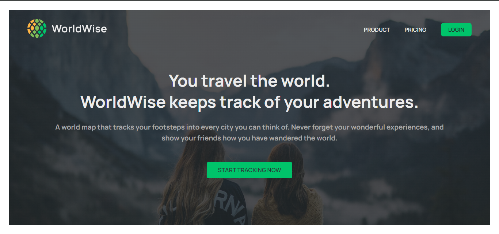
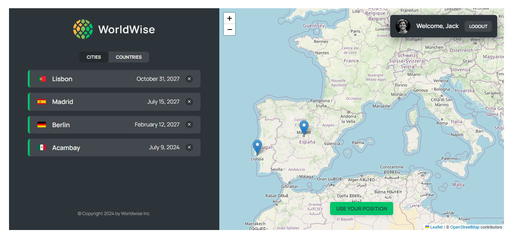

# Worldwise

This project based on React Udemy Course by Jonas Schmedtmann. [(Master modern React from beginner to advanced! Next.js, Context API, React Query, Redux, Tailwind, advanced patterns)](https://www.udemy.com/course/the-ultimate-react-course/)

## Daftar Isi

- [Overview](#overview)
  - [The challenge](#the-challenge)
  - [Screenshot](#screenshot)
  - [Project Setup](#project-setup)
- [My process](#my-process)
  - [Built with](#built-with)
  - [What I learned](#what-i-learned)
  - [Useful resources](#useful-resources)
- [Author](#author)

## Overview

### About the Project

Worldwise App is web application designed for users to track cities they have visited by clicking on a map and adding notes to each city. It utilizes a JSON-server as a simple backend API and features basic login functionality with username and password, focusing on ease of use without complex validation. Users can leverage GPS location services to identify their current location and seamlessly create new tracks by sending POST requests to the JSON-server. The application displays a list of visited cities along with notes and timestamps, as well as a map with markers indicating every city the user has explored.

### Screenshot

**Tampilan Desktop**



### Project Setup

Clone the project

```bash
  git clone https://github.com/abimh66/worldwise
```

Go to the project directory

```bash
  cd worldwise
```

Install dependencies

```bash
  npm install
```

Start the json-server

```bash
  npm run server
```

Start the app

```bash
  npm run dev
```

## My process

### Built with

- ReactJS
- React Router
- Context API + Reducer for State Management
- CSS Modules
- React Leaflet

### What I learned

Through this project, I acquired valuable skills and knowledge in several areas:

- **Project Structure**: I gained experience in structuring a React application, organizing components, pages, contexts and custom hooks in a scalable and maintainable manner.

- **React Router for Single Page Applications**: I successfully implemented React Router to manage navigation and create a seamless single-page application (SPA) experience, enhancing usability and performance.

- **Context API + React Reducer for State Management**: I mastered the use of Context API along with React Reducer to manage complex application state efficiently, providing a centralized approach to state management across components.

- **React Leaflet Integration**: I integrated React Leaflet library for displaying interactive maps within the application, gaining experience in configuring and customizing maps with markers and layers.

- **Creation of Custom Hooks**: I developed custom React hooks to encapsulate and reuse logic across different components, promoting code reusability and enhancing development efficiency.

These learnings enabled me to build a robust and interactive web application that meets the project requirements effectively, while also expanding my proficiency in modern web development practices with React and related technologies.

### Resources

- [React Documentation](https://react.dev/reference/react)
- [React Router Documentation](https://reactrouter.com/en/main/start/overview)
- [React Leaflet]('https://react-leaflet.js.org/docs/start-introduction/')

## Author

- Twitter - [@abimhrdnt](https://www.twitter.com/abimhrdnt)
- Frontend Mentor - [@abimh66](https://www.frontendmentor.io/profile/abimh66)
- Codewars - [@abimh66](https://www.codewars.com/users/abimh66)
